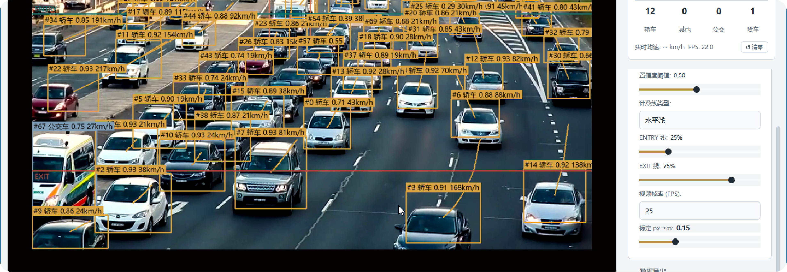

# 基于 YOLO26 的车流量检测系统

## 项目简介

本项目基于 2026 年 Ultralytics 最新发布的 YOLO26 目标检测算法，设计并实现了一套完整的车流量检测系统。系统串联了**数据集准备 → 模型训练 → ONNX 导出 → 车辆检测与跟踪 → 车流量统计与车速估算 → 桌面端应用打包**全流程。最终交付物包括可运行的 Python 源代码、Windows 桌面端可执行程序（exe）以及课程实践报告。




**核心功能：**
- 基于 YOLO26n 的车辆目标检测（car / van / bus / others 四类）
- 多目标实时跟踪（IoU + 匈牙利匹配 + 速度预测）
- 双向车流量统计（ENTRY / EXIT 双检测线）
- 实时车速估算（相邻帧位移 + 穿越测速双模式）
- PyQt5 桌面端图形界面（支持摄像头 / 视频文件输入）
- ONNX Runtime 跨平台推理（无需 PyTorch 环境）
- PyInstaller 打包的独立 exe 应用程序

**性能指标：**
| 指标 | 数值 |
|------|------|
| mAP@0.5 | 63.62% |
| mAP@0.5:0.95 | 49.82% |
| 精确率（Precision） | 80.37% |
| 召回率（Recall） | 67.22% |
| ONNX 推理速度（CPU） | 27.7ms / 帧（约 36 FPS） |
| 完整管线速度（CPU） | 约 35ms / 帧（约 28 FPS） |
| 模型大小 | 9.4 MB |

---

## 目录结构

```
项目代码/
├── README.md                 ← 本文件
├── requirements.txt          ← Python 依赖列表
├── convert_to_yolo.py        ← UA-DETRAC 数据集格式转换（XML → YOLO）
├── config/
│   └── ua_detrac.yaml        ← 数据集配置文件（参考用）
├── scripts/                  ← 模型组核心脚本
│   ├── train_yolo26.py       ← 模型训练
│   ├── export_onnx.py        ← 模型导出为 ONNX
│   ├── evaluate.py           ← 模型评估
│   └── track_test_onnx.py    ← ONNX 推理 + 多目标跟踪 + 车流量统计
└── vehicle_detection_app/    ← Web 组 PyQt5 桌面应用源码
    ├── main.py               ← 应用入口
    ├── core/                 ← 检测、跟踪、计数、视频处理核心模块
    ├── ui/                   ← PyQt5 界面组件
    └── utils/                ← 配置和数据导出工具

可执行程序/
└── VehicleDetectionSystem.exe  ← 打包好的独立可执行文件（双击启动）


## 一、环境配置

### 1.1 硬件要求

| 项目 | 最低配置 | 推荐配置 |
|------|---------|---------|
| 操作系统 | Windows 10/11 64 位 | Windows 11 64 位 |
| CPU | Intel i5 第 8 代 | Intel i7-13650HX |
| 内存 | 8 GB | 16 GB |
| GPU（训练用） | NVIDIA GPU 8GB 显存 | NVIDIA RTX 4060 8GB |
| GPU（推理用） | 不需要 | 不需要 |

> **说明：** 推理阶段（track_test_onnx.py、exe 应用）完全不需要 GPU，纯 CPU 即可运行。仅训练阶段需要 GPU。

### 1.2 安装 Python 依赖

```bash
cd 项目代码
pip install -r requirements.txt
```

主要依赖包括：
- `onnxruntime` — ONNX 模型推理引擎
- `opencv-python` — 图像处理和视频 I/O
- `numpy` — 数值计算
- `ultralytics` — YOLO 训练框架（仅训练/评估时需要）
- `PyQt5` — 桌面 GUI（仅运行 GUI 时需要）
- `scipy` — 匈牙利算法（跟踪匹配）

### 1.3 模型文件

训练好的最佳模型权重为 `best_train2.pt`，已导出为 ONNX 格式 `best_train2.onnx`（9.4 MB）。

- 如果仅**运行推理**（track_test_onnx.py 或 exe），只需 `best_train2.onnx`。exe 已内置模型，无需额外操作。
- 如果**重新训练**，需要 `yolo26n.pt`（COCO 预训练权重），运行脚本时会自动下载。
- 如果**运行 evaluate.py** 做评估，需要 `best_train2.pt`。

---

## 二、从零开始的完整流程

以下按实际项目执行顺序排列。如果只想运行已有模型做推理，直接跳至第五节。

### 2.1 数据集准备

**数据集：** [UA-DETRAC](https://detrac-db.rit.albany.edu/) —— 北京航空航天大学与微软亚洲研究院联合发布的大规模车辆检测与跟踪基准数据集，包含约 14 万帧图像，超 100 万个标注边界框，涵盖 car / van / bus / others 四类车型。

**原始目录结构（下载后）：**
```
data/UA-DETRAC(车辆检测数据集8250车辆)/
├── DETRAC-Train-Annotations-XML/   ← XML 标注文件（60 个序列）
├── Insight-MVT_Annotation_Train/   ← 训练图片（按序列分文件夹）
└── Insight-MVT_Annotation_Test/    ← 测试图片
```

**执行格式转换：**
```bash
cd 项目代码
python convert_to_yolo.py
```

这一步会：
1. 解析每个序列的 XML 标注，提取 vehicle_type 和边界框
2. 将 [xmin, ymin, xmax, ymax]（像素坐标）转换为 YOLO 格式 `[class_id, center_x, center_y, width, height]`（0~1 归一化）
3. 按视频序列级别以 8:2 比例划分训练集和验证集
4. 生成 `data/ua-detrac/data.yaml` 配置文件
5. 输出统计信息（各类别样本数量分布）

**输出结构：**
```
data/ua-detrac/
├── images/
│   ├── train/       ← 训练图片
│   └── val/         ← 验证图片
├── labels/
│   ├── train/       ← YOLO 格式标注
│   └── val/
└── data.yaml        ← 数据集配置
```

### 2.2 模型训练

```bash
cd 项目代码
python scripts/train_yolo26.py
```

**训练策略：** 基于 COCO 预训练权重 `yolo26n.pt` 进行迁移学习。

**训练配置（train_yolo26.py 内的默认值）：**

| 参数 | 值 | 说明 |
|------|------|------|
| epochs | 50 | 最大训练轮数 |
| imgsz | 640 | 输入图片尺寸 |
| batch | 16 | 批次大小 |
| optimizer | AdamW | 优化器 |
| lr0 | 1×10⁻³ | 初始学习率 |
| lrf | 1×10⁻² | 最终学习率衰减因子 |
| momentum | 0.937 | 动量 |
| weight_decay | 5×10⁻⁴ | 权重衰减 |
| warmup_epochs | 3 | 学习率预热轮数 |
| patience | 10 | 早停轮数（验证集 mAP 连续 10 轮无提升则停止） |
| box | 7.5 | 边界框回归损失权重 |
| cls | 0.5 | 分类损失权重 |

**数据增强（针对交通场景优化）：**

| 策略 | 概率/参数 | 作用 |
|------|----------|------|
| Mosaic | 1.0 | 四图拼接，制造密集车流场景 |
| MixUp | 0.2 | 两张图混合，模拟半透明遮挡 |
| Copy-Paste | 0.25 | 随机粘贴车辆，制造重叠样本 |
| HSV 扰动 | h=0.015, s=0.7, v=0.4 | 模拟不同光照条件 |
| 旋转 | ±5° | 增强角度鲁棒性 |
| 平移 | ±10% | 增强位置鲁棒性 |
| 缩放 | ±50% | 增强尺度鲁棒性 |
| 剪切 | ±2° | 增强形变鲁棒性 |
| 左右翻转 | 概率 0.5 | — |

**训练输出：**
```
runs/detect/ua-detrac-yolo26/train2/
├── weights/
│   ├── best.pt        ← 验证集 fitness 最高的权重
│   └── last.pt        ← 最后一轮权重（断点续训用）
└── results.csv        ← 每轮训练指标
```

**断点续训：** 如果训练中断（GPU 掉线、手动停止等），再次运行 `python scripts/train_yolo26.py` 会自动检测 `last.pt` 并从中断处恢复训练。

### 2.3 模型评估

```bash
cd 项目代码
python scripts/evaluate.py
```

会在验证集上运行完整评估，输出：
- mAP@0.5、mAP@0.5:0.95
- Precision、Recall
- 各类别 AP（car / van / bus / others）
- PR 曲线、混淆矩阵、F1 曲线、指标柱状图（保存至 `runs/evaluate/`）

**本项目的评估结果：**

| 指标 | 数值 |
|------|------|
| mAP@0.5 | 0.6362 |
| mAP@0.5:0.95 | 0.4982 |
| Precision | 0.8037 |
| Recall | 0.6722 |

| 类别 | AP@0.5:0.95 |
|------|-------------|
| car | 0.5922 |
| van | 0.4963 |
| bus | 0.5900 |
| others | 0.3143 |

### 2.4 模型导出为 ONNX

本系统支持两种 ONNX 导出方式：

**方式一：训练末尾自动导出（train_yolo26.py 内置）**

训练完成后自动调用 `model.export(format="onnx", imgsz=640)`，快速导出基础 ONNX。

**方式二：独立精细化导出（export_onnx.py）**

```bash
cd 项目代码
python scripts/export_onnx.py
```

提供精细控制：指定 opset=14（广泛兼容性）、simplify=True（精简计算图）、FP32 精度、附带 PT vs ONNX 速度基准对比。

> **注意：** 导出前请检查 `export_onnx.py` 中的 `MODEL_PATH` 变量是否指向正确的 `.pt` 权重文件。

---

## 三、运行推理与车流量统计（track_test_onnx.py）

这是模型组的核心推理脚本，不需要 PyTorch 或 Ultralytics 环境，仅依赖 onnxruntime 和 OpenCV。

### 3.1 基本运行

```bash
cd 项目代码
python scripts/track_test_onnx.py
```

脚本会：
1. 加载 ONNX 模型
2. 分析视频前 30 帧光流，自动判断车流方向并设置检测线位置
3. 逐帧执行：预处理 → ONNX 推理 → 按类别 NMS → IoU 跟踪器匹配 → 轨迹更新 → 计数判断 → 可视化
4. 输出叠加了检测框、轨迹线和计数的视频
5. 保存轨迹数据（JSON）和统计汇总（CSV）

### 3.2 配置参数

编辑 `track_test_onnx.py` 开头的配置区：

```python
ONNX_MODEL = "best_train2.onnx"     # ONNX 模型路径
VIDEO_SOURCE = "test3.mp4"           # 视频文件路径（或摄像头编号 0）
CONF_THRESH = 0.25                   # 检测置信度阈值
IOU_THRESH = 0.45                    # 跟踪 IoU 阈值
NMS_IOU_THRESH = 0.3                 # NMS IoU 阈值（按类别）
MIN_TRAJ_LENGTH = 5                  # 最小有效轨迹长度（帧）
MIN_AREA = 500                       # 最小检测框面积（过滤误检）
MAX_DISAPPEARED = 30                 # 最大丢失容忍帧数
MAX_DISTANCE = 80                    # 匹配距离半径（像素）
PIXELS_TO_METERS = 0.15              # 像素→米标定系数
SAVE_VIDEO = True                    # 是否保存输出视频
SHOW_PREVIEW = True                  # 是否实时显示画面
```

### 3.3 算法说明

**按类别 NMS：** 传统 NMS 对全体检测框做去重，拥挤场景下可能把不同类别的相邻车辆误删。按类别 NMS 仅在同类之间比较 IoU，轿车和货车各保留一个。

**IoU 跟踪器：** 比 DeepSORT 更轻量。利用 IoU（交并比）和中心点距离的加权组合（0.4 IoU + 0.6 距离）作为相似度，通过匈牙利算法做全局最优匹配。额外加入了速度预测（EMA 平滑），通过历史轨迹预估下一帧位置，解决快速运动导致的 IoU 失配问题。

**车流量计数：** 可在画面中自定义 ENTRY、EXIT 两条检测线。车辆轨迹长度 ≥ 5 帧且中心点穿越检测线后触发计数。每个 track_id 只计数一次，避免重复。方向判断基于轨迹首尾点位移。

**车速估算（两种方式并存）：**
- 实时速度：相邻帧像素位移 × 标定系数 × FPS × 3.6 → km/h，经 EMA（α=0.3）平滑，每 2 秒更新一次显示
- 穿越测速：记录车辆穿越两条检测线的帧号差 ÷ FPS = 时间，检测线间距 × 标定系数 = 距离，距离 ÷ 时间 × 3.6 = km/h。结果更准确，但需车辆完成双线穿越后才触发

---

## 四、运行 GUI 桌面应用（vehicle_detection_app）


### 4.1 源码运行

```bash
cd 项目代码/vehicle_detection_app
python main.py
```

> **注意：** 需将 `best_train2.onnx` 放在 `vehicle_detection_app/` 同级目录下。当前目录结构已包含模型路径处理逻辑 `resource_path()`，源码运行和 exe 打包均可正确定位。

### 4.2 GUI 功能

- 摄像头实时检测 / 本地视频文件检测
- 视频播放控制（播放 / 暂停 / 停止 / 进度拖动 / 倍速）
- 实时检测画面展示（检测框、轨迹线、速度标签、ENTRY/EXIT 线）
- 检测线拖动调整（直接在视频画面上拖动计数线）
- 车辆统计面板（总车辆数、IN/OUT 计数、车型分类、实时均速、FPS）
- 置信度阈值实时调节
- CSV 统计数据一键导出
- 浅色 Light Kinpaku 工作台风格 UI

### 4.3 直接运行 exe

如果不想配置 Python 环境，可以直接运行打包好的 exe：

```
双击 可执行程序/VehicleDetectionSystem.exe
```

该 exe 是单文件版本，内置了所有依赖库和 ONNX 模型，无需安装任何额外软件即可运行。首次启动可能需要 10~20 秒解压。

---

## 五、常见问题

### Q1：运行 track_test_onnx.py 报错 "No module named 'onnxruntime'"

```bash
pip install onnxruntime
```

### Q2：加载 ONNX 模型时报错 "Opset 22 is under development"

当前 onnxruntime 1.18 最高支持 opset 21。需使用 opset ≤ 21 的模型。本项目的 `best_train2.onnx` 是 opset 22，需要使用 `delivery/best.onnx`（已转为 opset 21），或升级 onnxruntime 到最新版。

### Q3：训练时显存不足（CUDA Out of Memory）

将 `train_yolo26.py` 中 `BATCH_SIZE` 从 16 降为 8 或 4。

### Q4：exe 双击没反应

在 PowerShell 中切到 exe 所在目录，运行 `./VehicleDetectionSystem.exe` 查看错误信息。常见原因是杀毒软件拦截、或被要求确认运行。

### Q5：摄像头打不开

确认摄像头未被其他软件占用。在 Windows 隐私设置中，允许桌面应用访问摄像头。

### Q6：想用自己的视频测试

将视频文件放到任意位置，修改 `track_test_onnx.py` 中的 `VIDEO_SOURCE` 变量，或在 GUI 应用中通过"打开视频文件"选择。
